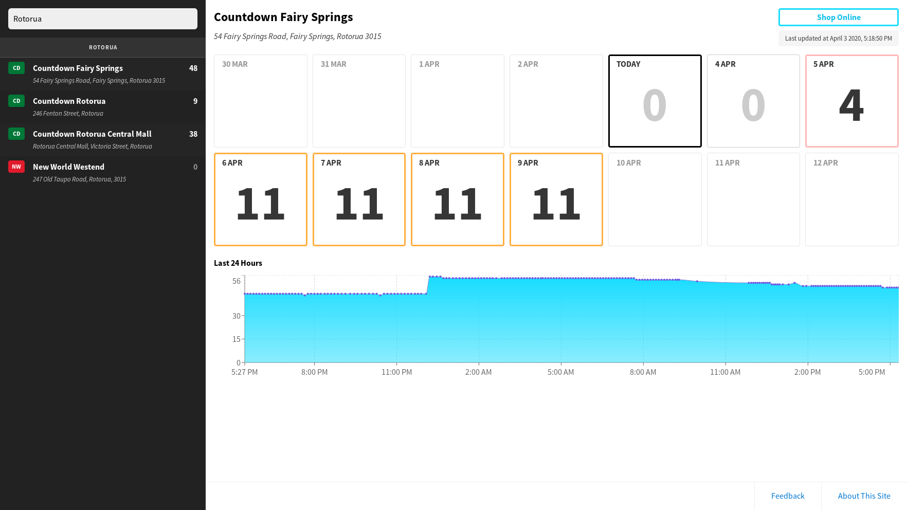

# [clickandcollect.nz](https://clickandcollect.nz)

## What is this for?

Many supermarkets in New Zealand offer a "Click & Collect" service, which you
can use to order your groceries online and then pick them up at the store,
already bagged.

During the COVID-19 pandemic, there has been a large increase in the number
of online orders, and supermarkets are often booked out of available timeslots.
However, at certain points throughout the day (particularly around midnight),
supermarkets will release new slots.

This website tracks and displays the available timeslots across hundreds of
supermarkets, helping you to find which supermarkets have the most
availability and to find the best time to order your groceries.

If you are interested in how I built this, I wrote [a short article about it on
my blog](https://george.czabania.com/2020_03_31/).

## What supermarkets do you display?

The website currently tracks four chains of supermarkets:

- [Countdown](https://shop.countdown.co.nz)
- [FreshChoice](https://store.freshchoice.co.nz)
- [New World](https://ishopnewworld.co.nz)
- [PAK'nSAVE](https://paknsaveonline.co.nz)

Only stores that support Click & Collect are tracked.

## What about delivery?

Delivery timeslots are not supported by this website.

## How up to date is the availability data?

The availability data is refreshed every 5 minutes. The time the data was last
collected for a particular supermarket is displayed in the upper-right corner
of the site.

## License

This source code of this website is available under the MIT license.

The code for the scraping mechanism has not been published. If you are
interested in the data, you can find a regularly updated snapshot at the
[clickandcollect.nz.api
repository](https://github.com/stayradiated/clickandcollect.nz.api).
